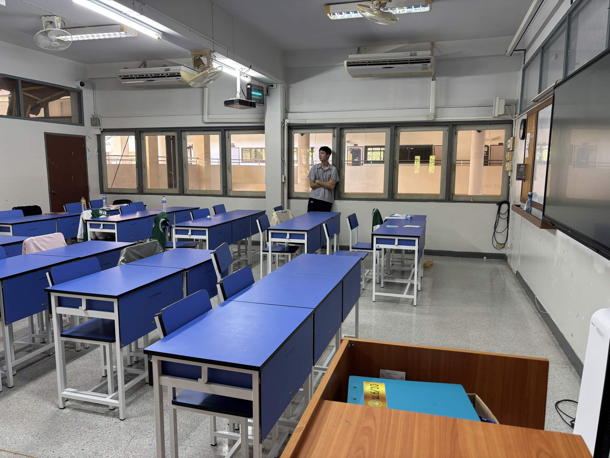

# Quantum Experience

Interactive bilingual lab (Thai / English) for basic quantum ideas.
Built with the SCIUS team at Burapha University for school booths — drag a gate, watch a bar move, hold Space and split.

<p align="center">
  
</p>

`HTML` `CSS` `vanilla JS` · static files, no backend · TH + EN

---

## Why this exists

Most intro-to-quantum pages are slides. Kids tap Next and leave.

We wanted something they can *break*. If they only remember one thing after the booth, it should be: a qubit is not a coin flip with extra steps.

The project also lives behind a Thai hostname used on booth machines (`เรียนควอนตัม.com`). **This repository is the thing to read** — source, circuit notes, how to run it locally. The public box is just how we load it onto school laptops.

---

## What is in the lab

| | Room | What happens |
| --- | --- | --- |
| 🧪 | Lab stations | Superposition, measurement, entanglement, interference, tunneling |
| ⚡ | Station 7 · Circuit | Drag H / X / CNOT / Oracle / Diffusion onto 3 wires. Run. Bars peak on \|2⟩ |
| 🎮 | Qubit Runner | Canvas runner. Hold `Space` to split and phase through walls |
| 🌀 | Extra rooms | Aura intro, text-the-particle, match / duel, co-op entanglement |

Language toggle is in the header. `TH` ↔ `EN`.

---

## Run it from this repo

Serve the folder. Some browsers block the classroom video on `file://`.

```bash
python3 -m http.server 8080
```

Open [http://localhost:8080](http://localhost:8080)

```bash
npx serve .
```

```bash
docker build -t quantum-experience .
docker run --rm -p 3000:3000 quantum-experience
```

No `npm install` just to open the site. Playwright in `package.json` is optional.

---

## How the circuit piece works

Station 7 is a state vector on **3 qubits** (8 complex amplitudes).

1. start at \|000⟩
2. H on each wire → uniform superposition
3. Oracle flips the phase of \|2⟩ (`010`)
4. Diffusion amplifies that amplitude
5. one Grover iteration → \|2⟩ around **82%**

Enough to *see* Grover on a booth laptop. Not Qiskit. Does not scale past 3 qubits. That was the constraint: math on screen, loop under a second.

---

## Layout

```
index.html        entry + page shells
app.js            i18n + topic pages
lab.js            home, stations, Quantum Core
circuit.js/.css   drag-and-drop builder
game.js/.css      Qubit Runner
aura.js chat.js coop.js duel.js why.js
styles.css        shared theme
images/           station diagrams
Dockerfile        nginx:alpine, port 3000
```

---

## Team

| Role | Name |
| --- | --- |
| Dev | Chonlatee Sukwiwattanaporn |
| Dev | Pawat Iemsupapong |
| Advisor | Aukrit Natkaew |

SCIUS BUU · Faculty of Science, Burapha University

## License

MIT on the code. SCIUS / BUU logos stay with their owners.
